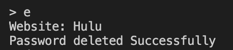

# Password Manager

## Program Description: 
This program is made to help those who might need a little help remembering their passwords. Using Google Firebase, this program can upload all of your accounts and passwords to the cloud, making it easily accessible from anywhere. You'll never forget a password again. Simply create an account, and the options will be displayed to you. You can add passwords, delete passwords, edit passwords and display all passwords inside your account. Access will not be given to you outside of your account.

## Setting up Development Environment and Building:
To se up the development evironment first you have to use the command ```pip install firebase-admin``` to install the correct software needed to connect with the server. Next download the file main.py. This file contains the entirety of the program and will run when executed. To execute the program type in ```python ```followed by the locaton of the file, for example ```python /home/desktop/main.py``` will run the program on my computer because the file is located on the desktop.

## Working with Firebase:
For the program to interact with a database, you will need to create your own database. To do this go to www.firebase.google.com and sign into your google account. After that, you can create your own firestore database. After creating the database you need to download a personal service account key. For clear instructions, please see [this video.](https://www.youtube.com/watch?v=yylnC3dr_no)

## Software Screenshots:


~Main menu and options of program


~displaying all the passwords in Current directory


~Deleting a created Password

## Commands for API
* where() - The where command is used like an if-statement to determine if there is something in a certain database or location
* get() - Gets a snapshot of what is currently in a directory
* update() - updates a directory
* delete() - deletes a document or directory
* add() - Add items to a document without editing anything inide the document. Can also be used to make a collection with a randomized name
* set() - Sets everything inside of a document to the value inside of set. Used to create collections and documents

## Useful Websites
* [Firestore Quieries](https://firebase.google.com/docs/firestore/query-data/queries)
* [Delete Data](https://firebase.google.com/docs/firestore/manage-data/delete-data)
* [Firestore Commands](https://firebase.google.com/docs/cli)
* [Getting Started with Firestore in Python](https://www.youtube.com/watch?v=yylnC3dr_no&t=1s)
